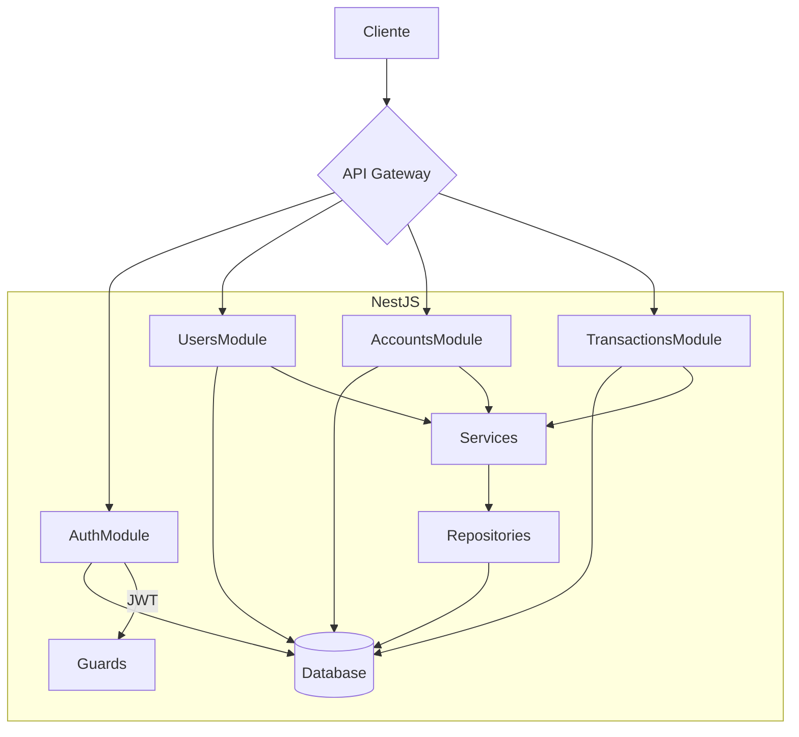

<h1 align="center">
    <a href="#" alt=""> Open Banking Application </a>
</h1>

<h4 align="center">
	🚧 Em produção 🚧
</h4>

<p align="center" >
 <a href="#sobre-o-projeto"> 📌 Sobre o projeto</a> •
 <a href="#layout">Layout</a> • 
 <a href="#rodando-o-projeto">Rodando o projeto</a> •
 <a href="#tecnologias">Tecnologias</a> •
 <a href="#contribuição">Contribuição</a>
</p>

## 📂 Sobre o projeto
Desenvolvimento de um backend robusto para Open Banking, aplicando boas práticas de engenharia de software com ênfase em usabilidade, código limpo e documentação completa.


## 🎨 Layout


### Componentes Chave



Este diagrama mostra:
1. **Separação clara de módulos**
2. **Fluxo unidirecional de dados**
3. **Hierarquia de componentes**
4. **Integração com banco de dados**
5. **Proteção das rotas via JWT**


### ⚙️ Rodando o projeto
```bash

1. Clone o repositório:
    git clone git@github.com:leandrojsantos/test-open-banking-codeFabrik.git
    cd open-banking-api-nest

2. Crie um arquivo `.env` baseado no `.env.example` e configure as variáveis de ambiente necessárias.
    cp .env.example .env se preferir mude os dados no arquivo ".env"

3. Execute a aplicação: # obs: Execute o comando no bash dento da pasta raiz do projeto ../api-nest:
    make iniciar

4. Acesse o arquivo ./api-nest/README-API-DOCS.md e siga as instruções veja a documentação da API

```

## 🛠️ Tecnologias
As seguintes ferramentas foram usadas:
- [x] API REST com Nest
- [x] Testes com Jest
- [x] Containerização com Docker
- [x] Banco de dados relacional com PostgreSQL
- [x] Documentação da API na pasta "open-banking-api-nest"
- [x] Usabilidade da API, código limpo e padrão de projeto

## 📜 Contribuição

  Faça um fork do projeto em seguida:

  1. Crie sua branch (git checkout -b feature/newFeature)
  2. Commit suas mudanças (git commit -m 'feat: descricao breve da newFeature')
  3. Push para a branch (git push origin feature/newFeature)
  4. Abra um Pull Request no github