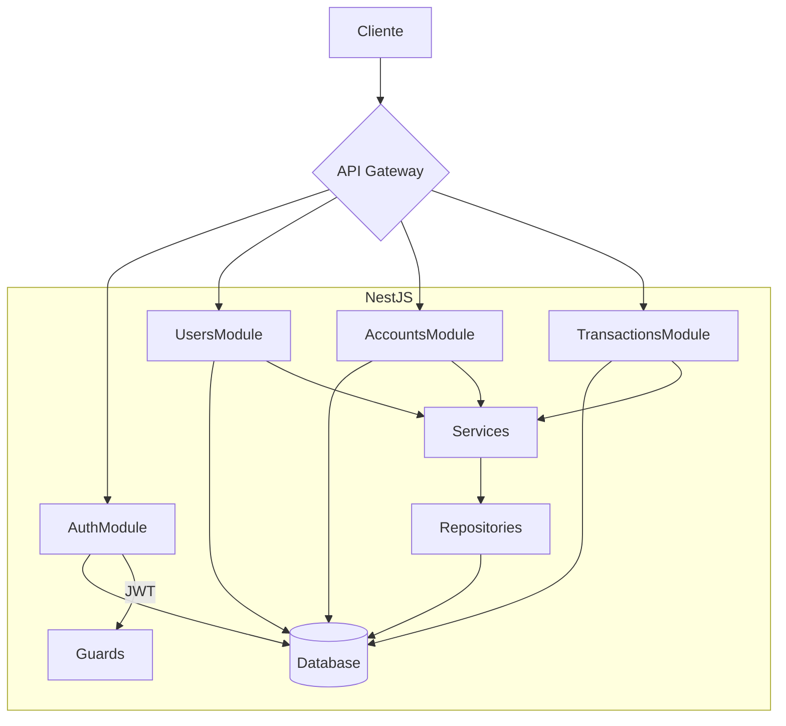

<h1 align="center">
    <a href="#" alt=""> Documentação da Api </a>
</h1>

<h4 align="center">
	🚧 Em produção 🚧
</h4>

<p align="center">
 <a href="#funcionalidades">Funcionalidades</a> • 
 <a href="#pré-requisitos">Pré-requisitos</a> •
 <a href="#rodando-o-projeto">Rodando o back-end</a> •
 <a href="#testes">Testes</a> •
 <a href="#endpoints-principais">Endpoints Principais</a> •
 <a href="#considerações-finais">Considerações Finais</a> 
</p>

## Funcionalidades
API para sistema de Open Banking desenvolvida com NestJS, PostgreSQL e Docker com:
- Autenticação JWT
- Gerenciamento de usuários
- Criação e gerenciamento de contas bancárias
- Realização de transações (depósito, saque, transferência)
- Documentação Swagger integrada


### Diagrama de Fluxo da API
#### Componentes Chave



**Este diagrama mostra:**
1. **Separação clara de módulos**
2. **Fluxo unidirecional de dados**
3. **Hierarquia de componentes**
4. **Integração com banco de dados**
5. **Proteção das rotas via JWT**

### Legenda do Fluxo

1. **Autenticação**:
   - Cliente faz login obtendo JWT
   - Token é usado em requisições subsequentes

2. **Gestão de Usuários**:
   - Criação de novos usuários
   - Validação de dados

3. **Gestão de Contas**:
   - Criação de contas bancárias
   - Associação automática ao usuário

4. **Operações Financeiras**:
   - Depósitos/saques (transações simples)
   - Transferências entre contas
   - Atualização em tempo real dos saldos

5. **Fluxo Típico**:
   - Controllers recebem requests
   - Services processam regras de negócio
   - Repository acessa o banco de dados
   - Respostas retornam ao cliente

## Pré-requisitos
Deve ter instalado em sua máquina: 
- Node.js 16+
- Docker 20+
- PostgreSQL 15+

As seguintes tecnologias foram usadas:
- Backend: NestJS (Node.js)

- Banco de Dados: PostgreSQL + TypeORM

- Autenticação: JWT + Passport

- Documentação: Swagger

- Containerização: Docker

- CI/CD: GitHub Actions

- Testes: Jest + Supertest

- Monitoramento: Health Checks

## Rodando o projeto
```bash

1. Clone o repositório:
 $ git clone git@github.com:leandrojsantos/test-open-banking-codeFabrik.git
 $ cd open-banking-api-nest

2. Crie um arquivo `.env` baseado no `.env.example`

3. Execute `docker-compose up -d` para subir os containers

4. Execute as migrações: `npm run typeorm migration:run`

5. Escolha uma da versões:
# versão dev
npm install
npm run start:dev

# versão produção
npm run build
npm run start:prod

6. Acesse a documentação em:
    - API : http://localhost:3000/api 
    - Swagger UI (Rotas da api): http://localhost:3000/api
    - PGAdmin (Banco de dados da api use os dados ".env"): http://localhost:5050
    - Health Check: http://localhost:3000/health


```
## Testes
```bash
# Cobertura de testes em dev
npm test
npm run test:cov 

# Cobertura de testes em produção
npm run build
npm run start:prod

```

## Endpoints Principais
```bash
# Autenticação
POST /auth/login       - Login de usuário

# Usuários
POST /users            - Cria novo usuário
GET  /users            - Obtém todos usuários
GET  /users/{id}       - Obtém usuário por ID

# Contas
POST /accounts         - Cria nova conta
GET  /accounts         - Lista contas do usuário
GET  /accounts/{id}    - Obtém conta específica

# Transações
POST /accounts/{id}/transactions      - Cria transação
POST /accounts/{id}/transfer          - Transfere entre contas
GET  /accounts/{id}/transactions      - Lista transações

```

## Considerações Finais
Esta implementação segue boas práticas de desenvolvimento como:

1. **Separação de responsabilidades**
   - controllers, 
   - services, 
   - entidades,
   - DTOs

2. **Segurança**: 
   - Autenticação JWT
   - Senhas hasheadas com bcrypt
   - Validação de dados com class-validator

3. **Documentação**: 
   - Swagger integrado
   - README completo

4. **Testabilidade**: 
   - Módulos independentes
   - Configuração do Jest

5. **Escalabilidade**: 
   - Docker para ambiente isolado
   - TypeORM para abstração do banco de dados

6. **Boas práticas de código**: 
   - Tratamento de erros
   - DTOs para validação
   - Interfaces claras

